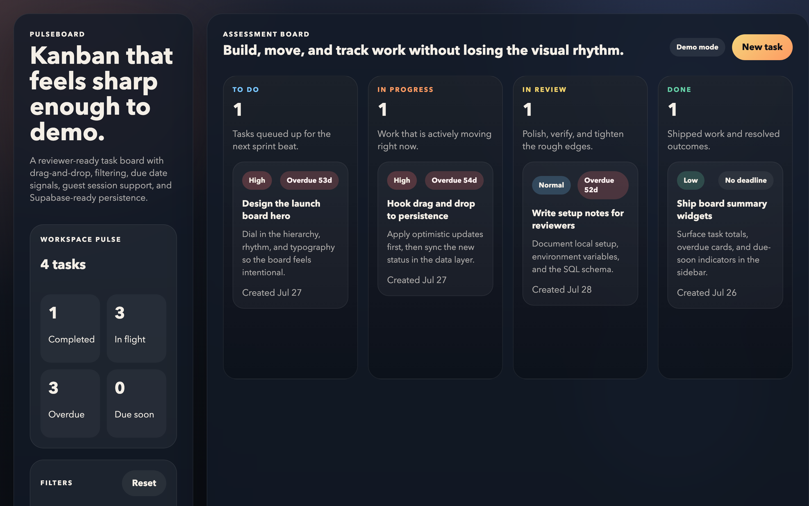

# PulseBoard

A Kanban task board with drag-and-drop status updates, filtering, due-date urgency signals, and real-time persistence backed by Supabase.

**[Live demo →](https://pulseboard-red.vercel.app)**



## Features

- Drag-and-drop status updates with optimistic UI
- Search and filtering by title, notes, and priority
- Due-date urgency indicators (overdue, due soon, no deadline)
- Workspace summary stats
- Guest sessions through Supabase anonymous auth
- Demo fallback mode that runs without any backend configuration

## Stack

React 19 · TypeScript · Vite · Supabase (PostgreSQL, auth, realtime)

## Run locally

```bash
pnpm install
pnpm dev
```

The app starts in **demo mode** and persists sample tasks to `localStorage`, so no backend setup is needed to try it.

To run against your own Supabase project instead:

```bash
cp .env.example .env
```

Then add your project values to `.env`:

```bash
VITE_SUPABASE_URL=...
VITE_SUPABASE_ANON_KEY=...
```

## Supabase setup

1. Create a new Supabase project.
2. Enable anonymous sign-ins in `Authentication > Providers > Anonymous`.
3. Run the SQL in [supabase/schema.sql](supabase/schema.sql).
4. Add the public `Project URL` and `anon` key to `.env`.

## Deployment

Deploys as a static Vite app to Vercel, Netlify, or Cloudflare Pages. Set the same two environment variables in the host dashboard.
